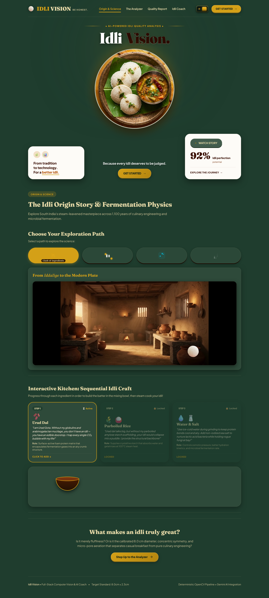
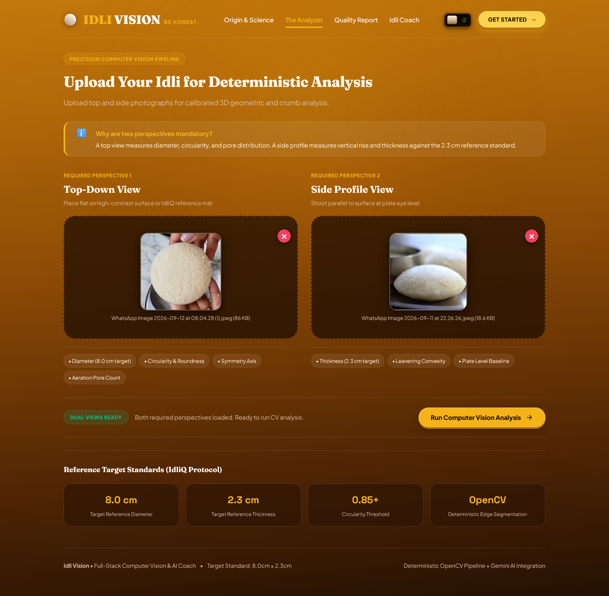
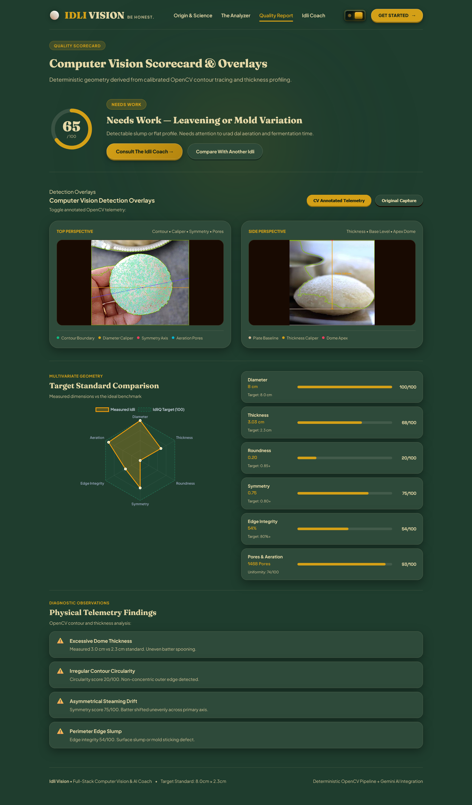
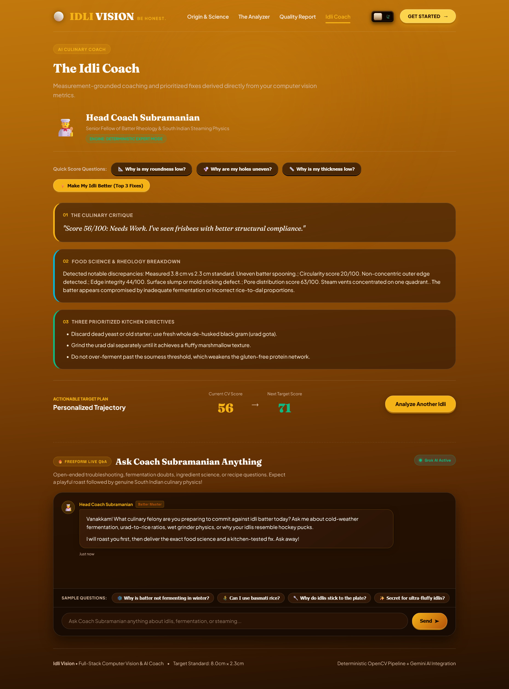

# Idli Vision

## Basic Details
### Team Name: Simplex

### Team Members
- Team Lead: Joel Antony - Toc H Institute of Science and Technology
- Member 2: Kaliraj - Toc H Institute of Science and Technology

### Project Description
Idli Vision is a analyzer that checks the roundness, thickness, diameter, number of pores/deformity, symmetry and egde integrity of the idli that the user uploads and scores it based on those factors. It then passes that information to idli coach who then gives tips on how to improve the idli and there's an AI chatbot that solves the user's doubts about idlis

### The Problem (that doesn't exist)
How to know if the idli that you're eating is perfect or not

### The Solution (that nobody asked for)
Idli Vision is our solution which analyzes the flaws of idli based on certain criteria and gives it a score

## Technical Details
### Technologies/Components Used
For Software:
- Languages used: JavaScript (Node.js), Python, HTML, CSS
-Frameworks used: Express.js (backend server)
-Libraries used:
        OpenCV (Python) — contour detection, image preprocessing, measurement extraction
        NumPy — numerical operations for CV calculations
        Multer — file upload handling (Node.js/Express)
        Chart.js — data visualization (radar chart, score bars)
-APIs used:
        Gemini API — structured Idli Coach report, roast + advice generation
        Grok API — freeform conversational chatbot
-Tools used:
        Git & GitHub — version control
        VS Code / Antigravity — development environment
        npm — package management
        pip — Python dependency management

### Implementation
For Software:
# Installation
 # Clone the repository
git clone https://github.com/shadow-777-j/idli_vision.git
cd idli_vision

# Install Node.js dependencies
npm install

# Set up Python environment for computer vision
cd vision
python -m venv venv
venv\Scripts\activate          # Windows
source venv/bin/activate       # macOS / Linux

pip install -r requirements.txt --break-system-packages
cd ..

# Create environment file and add API keys
cp .env.example .env
# Open .env and add:
# GEMINI_API_KEY=your_key_here
# GROK_API_KEY=your_key_here

# Run
# Start the backend server
cd backend
node server.js

# Open the frontend
# Navigate to frontend/index.html in your browser,
# or if served via Express static files, visit:

https://idli-vision.joelantony869.workers.dev/

### Project Documentation
For Software:

# Screenshots (Add at least 3)

Here this image shows the home page of our website where a fun idli animation and an user interactable game

This image shows the slots for uploading top and side view of the idlis

This image shows the result of our idli analyzer featuring various parameters

This image shows the Idli coach who gives tips on how to improve our idli and an AI chatbot that answers our questions with roasts

# Diagrams

                              IDLI VISION — SYSTEM WORKFLOW
                              ===============================

  USER (Browser)
      │
      │  1. Explores origin story, plays ingredient cooking mini-game
      │  2. Uploads Top View + Side View images of idli
      ▼
┌─────────────────────────┐
│   FRONTEND               │
│  HTML + CSS + JS         │
└─────────────────────────┘
      │
      │  POST /api/analyze  (images via Multer)
      ▼
┌─────────────────────────┐
│   BACKEND                │
│  Node.js + Express       │
└─────────────────────────┘
      │
      │  spawns child process, passes image paths
      ▼
┌─────────────────────────┐
│   COMPUTER VISION        │
│  Python + OpenCV         │
├─────────────────────────┤
│  • Preprocess image      │
│  • Detect contour        │
│  • Calibrate px → cm     │
│  • Diameter               │
│  • Roundness              │
│  • Symmetry                │
│  • Deformity                │
│  • Thickness (side view)    │
│  • Pore/hole detection      │
│  • Pore distribution         │
└─────────────────────────┘
      │
      │  returns raw measurements as JSON
      ▼
┌─────────────────────────┐
│   SCORING ENGINE          │
│  backend/services/        │
│  scoringService.js        │
├─────────────────────────┤
│  • Normalize measurements  │
│  • Apply weighted formulas │
│  • Compute per-metric score│
│  • Compute overall score   │
│  • Assign category label   │
└─────────────────────────┘
      │
      │  structured score object
      │  { overallScore, diameter, thickness,
      │    roundness, symmetry, deformity,
      │    holeCount, holeDistribution }
      ▼
┌─────────────────────────┐
│   FRONTEND                │
│  Quality Report screen    │
│  (scores + annotated       │
│   overlay images)          │
└─────────────────────────┘
      │
      │  user clicks "Consult Idli Coach"
      │  or asks a quick-score question
      ▼
┌─────────────────────────┐
│   BACKEND                 │
│  geminiService.js          │
└─────────────────────────┘
      │
      │  sends structured score data
      ▼
┌─────────────────────────┐
│   GEMINI API                │
├─────────────────────────┤
│  • Interprets scores        │
│  • Generates roast           │
│  • Generates explanation      │
│  • Generates improvement plan  │
└─────────────────────────┘
      │
      │  structured coaching response
      ▼
┌─────────────────────────┐
│   FRONTEND                  │
│  Idli Coach — structured     │
│  report (Critique → Science  │
│  → Directives → Target Plan) │
└─────────────────────────┘

                    ── PARALLEL PATH: FREEFORM CHATBOT ──

  USER types a free question
      │
      ▼
┌─────────────────────────┐
│   FRONTEND                 │
│  Chat panel                │
└─────────────────────────┘
      │
      │  POST /api/chat
      ▼
┌─────────────────────────┐
│   BACKEND                  │
│  grokService.js             │
└─────────────────────────┘
      │
      ▼
┌─────────────────────────┐
│   GROK API                   │
├─────────────────────────┤
│  • Short roast + quick tip    │
└─────────────────────────┘
      │
      ▼
┌─────────────────────────┐
│   FRONTEND                    │
│  Chat response rendered        │
└─────────────────────────┘

  KEY SECURITY BOUNDARY
  ──────────────────────
  Browser  ──X──>  Gemini/Grok API      (never allowed)
  Browser  ───>  Backend  ───>  Gemini/Grok API   (only allowed path)

### Project Demo
# Video
[Watch the Project Demo Video](https://drive.google.com/file/d/15b99mbj6vS93kQ0thgPSuuD8ttkJP1gv/view?usp=drivesdk)

*This demo video showcases the full Idli Vision workflow: exploring the origin story paths, playing the interactive ingredient cooking mini-game, uploading dual-angle idli photos, deterministic OpenCV contour and pore telemetry analysis, dynamic radar chart scorecards, Gemini Idli Coach improvement advice, and Grok roast chat.*

## Known Limitations
- **Pore & Cavity Detection Sensitivity & Parameter Tuning**: Surface aeration pore identification combines Morphological Black-Hat depression filtering with local adaptive Gaussian thresholding, followed by non-maximum suppression (NMS) distance deduplication:
  - **Tuned Parameter Baseline**:
    - `k_bh`: `(15, 15)` elliptical structuring element for depression isolation.
    - `min_contrast_floor`: `8` (prevents low-contrast flat crumb grain noise from triggering).
    - `adaptive_c_val`: `-5` (ensures detected depressions meaningfully contrast with surrounding dome curvature).
    - `area range`: `4` to `220` pixels (filters single-pixel noise and macroscopic tears).
    - `circularity`: $\ge 0.22$ (admits natural micro-cavities while rejecting linear scratches).
    - `NMS suppression distance`: $\min\_dist = 10\text{ px}$ (suppresses nested or overlapping concentric circle detections across scales).
  - **Lighting & Micro-Shadow Dependence**: Detection relies on natural or oblique side lighting that creates micro-shadows within pores. Under direct overhead flash or extreme front-lighting, surface micro-shadows are washed out, resulting in fewer detected pores. Conversely, high-contrast directional raking light may accentuate shallower surface grain.
  - **Batter Texture & Fermentation Variance**: Coarse or un-milled batter (e.g. rava idli, rustic stone-ground batter) exhibits higher surface grain density than smooth, highly-fermented rice/urad batter, affecting relative pore counts.
- **Monocular 2D Calibration**: Diameter, thickness, roundness, and symmetry calibrations assume the camera is positioned reasonably perpendicular to the food plane without extreme optical fish-eye perspective distortion.

## Team Contributions
- Joel Antony: Backend, Computer Vision & AI Integration

Scope: Everything that measures, calculates, and reasons.

Node.js/Express backend architecture and routing (/api/analyze, /api/chat)
File upload handling and validation (Multer, image type/size/MIME checks, upload cleanup)
Python/OpenCV computer vision pipeline:
Idli contour detection and segmentation
Diameter, roundness, symmetry, and deformity calculation
Side-view thickness measurement
Pore/hole detection, distribution analysis, and contour-masking accuracy fixes
Measurement mat calibration (pixel-to-centimeter conversion)
Scoring engine design (scoringService.js) — weighted scoring formulas, category assignment, normalization logic
AI service integration:
geminiService.js — structured coaching report (roast, explanation, improvement plan)
grokService.js — freeform chatbot, response tuning, prompt engineering for personality and brevity
API security (environment variable management, key isolation, .env/.gitignore setup)
Error handling across the full pipeline (failed uploads, CV failures, API failures, malformed responses)
Testing and debugging the CV pipeline against reference images, iterative parameter tuning

- Kaliraj    :Frontend, UI/UX & Interactive Experience

Scope: Everything the user sees, clicks, and plays with.

Overall UI/UX design and theme (light mode + dark "Banana Leaf Night" mode, theme toggle switch, character-shower transition)
Homepage hero design and branding (logo integration, layout, typography, 3D pressable button system)
Interactive origin story section — "Choose Your Exploration Path," path-button animations, video integration (intro video, per-path videos)
"Interactive Kitchen" sequential cooking mini-game — ingredient cards, bowl-filling animation sequence, Cook/Reset logic, smoke transition, idli reveal
Analyzer page UI — upload interface, dual-view (top/side) explanation panels
Quality Report UI — score display, radar/metric visualizations, detection overlay rendering, empty-state handling before analysis
Idli Coach UI — structured report display, Quick Score Question buttons, freeform chatbot interface (chat panel, message rendering, input handling)
Responsive design and accessibility (keyboard navigation, focus states, semantic HTML, alt text)
All frontend JavaScript logic connecting UI interactions to backend API calls

---
Made with ❤️ at TinkerHub Useless Projects 

